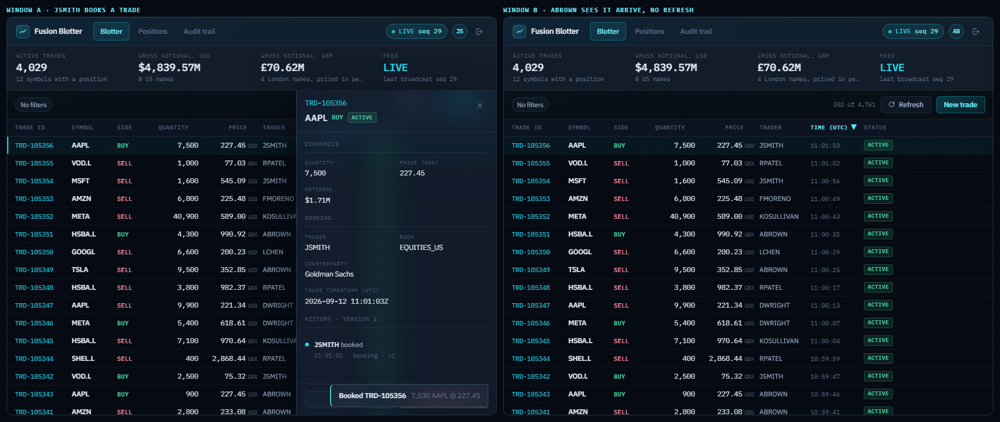

# Real-time equity trade blotter

A trade blotter for a broker: view, create, amend and cancel equity trades, with a change made in
one window appearing in every other connected window without a refresh.



Built for the TP ICAP full stack take-home exercise. Next.js 16 and React 19 on the front,
Express 5 and Socket.IO on the back, Prisma 7 over PostgreSQL 17, Redis for sessions, one shared
zod contract between them, and Docker Compose to run it all.

## Architecture decisions

```
frontend/   Next.js 16 App Router, React 19, Tailwind v4, TanStack Query and Table, socket.io-client
backend/    Express 5 + Socket.IO, Prisma 7 over PostgreSQL 17, Redis for sessions and rate limits
shared/     @blotter/shared: one zod schema per model, every other shape derived from it
database/   @blotter/database: the Postgres image, the Prisma schema, hand-written migrations and their runner
docs/       specs, prompt log, AI usage report, verification table
```

Each decision below: what was chosen, what it was chosen over, why, and what would change it.

**One shared contract package.** Over hand-written types on each side. A field added to
`trade_schema` reaches the API validation, the client types and the socket payload together, so
the three cannot drift. Would change if the client were not TypeScript.

**PostgreSQL.** Over SQLite. The API container runs on a read-only root filesystem, which a
SQLite file cannot survive, and Postgres carries real enums, a `DECIMAL(18,6)` price and an
append-only trigger. Would change if the brief asked for zero infrastructure.

**Socket.IO, broadcasts only.** Over raw WebSocket or SSE, and over mutations on the socket.
Reconnection with backoff comes for free and the event map is typed. Mutations stay on HTTP so
they get the same validation, error handling and rate limiting as any other write. Would change if
the client had to work behind a proxy that blocks upgrades and long-polling.

**One origin, the API behind the web server.** Over the browser calling the API directly. The web
server forwards `/api/*`, `/socket.io/`, `/health` and `/ready` over the internal network; the API
has no published port and `/metrics` is not forwarded. Every request and the socket are
same-origin, so no API address is compiled into the bundle, the refresh cookie needs no cross-site
settings, and a tunnel or TLS proxy in front of the web app needs only its address in
`CORS_ORIGINS`. This narrows what is exposed. It does not make the API private: every route is
still reachable through the forwarding, and authentication, validation and rate limits carry the
security. Costs a hop through the web server on every request. Would change if the API gained
clients other than this web app.

**Keyset paging.** Over offset. The blotter inserts rows all day, so an offset computed on one
request points somewhere else on the next: page two re-serves and skips rows. A cursor names a
row. Would change if the list were static.

**Cache patching, not refetching.** Every broadcast is applied to the cache in place: a trade
through one `apply_trade` function shared with the client's own mutations, an audit event into the
feed and the trade's history, a recomputed position into the positions list. The audit trail and
positions are fed by their own broadcasts rather than refetched when a trade arrives, so a window
left open makes no requests while the link is healthy; a refetch happens only on a sequence gap or
a reconnect. Over invalidating on every event, which cost one request per loaded page per
broadcast and tripped the rate limiter in ordinary use. Would change if broadcasts carried patches
instead of whole rows.

**TanStack Table, headless.** Over AG Grid. AG Grid brings its own theme and DOM, which would mean
the design tokens overriding a third-party stylesheet. Headless ships no styling, so the in-house
primitives own the look, with react-virtual for the rows. Would change if the grid needed pivoting
or grouping.

**Real authentication, three roles.** Over none. A blotter carries counterparty names, sizes and
prices, which is what a firm does not serve to anonymous readers. `VIEWER`, `TRADER` and `ADMIN`
map to named permissions; routes require the permission, never the role, and a trader may only
act on their own trades. Would change if the brief's guests-only reading were a requirement.

**Amendment is a version, not a status.** Over an `AMENDED` status. The brief allows `ACTIVE` and
`CANCELLED`; an amendment increments `version`, writes an audit row, and the grid shows a `v2`
pill. Would change if the brief's status enum were widened.

**Append-only audit enforced by a trigger.** Over a convention. An audit trail the application can
rewrite is not an audit trail. Would change only for a database without triggers.

**Mutations blocked while disconnected, never queued.** Over an offline queue. A confirmation for
a trade the server has not accepted is a worse failure on a desk than a disabled button. The
button says why it is disabled. Would change for a field app with intermittent connectivity.

**P&L on a simulated mark, labelled as such.** Over notional only, and over a real market feed the
brief does not supply. Average cost and realised P&L come from one walk in `shared/` that the
server runs after every write and broadcasts per symbol; unrealised P&L is the client marking the
open size against a mark that arrives over the socket every 900ms from a random walk around each
instrument's reference price. Every screen that shows a mark says it is simulated. Would change
the moment a market data feed replaced the walk, which is a one-file swap on the server.

**Filters and sort in the URL.** Over component state. A filtered blotter is linkable, survives a
reload, and the back button undoes a filter. Selection stays in memory. Would change if the grid
were embedded in another page.

**Prices in the instrument's currency, notional in its display currency.** London names are quoted
in GBX (pence), as the exchange quotes them, and the notional column shows pounds by dividing by a
hundred. No FX normalisation, so the desk notional limit is per currency. Would change with an FX
source.

The two design specs hold the rest: [the API](docs/superpowers/specs/2026-09-12-trade-api-design.md)
and [the interface behaviour](docs/superpowers/specs/2026-09-12-interface-behaviour-design.md),
each recording the options every decision was chosen from. The endpoints, payloads, errors and
configuration are in [`docs/api_reference.md`](docs/api_reference.md).

## Installation

Running the stack requires Docker with Compose v2 and no `.env` file: compose carries development
values and the API refuses a signing secret under 32 characters, so a placeholder cannot quietly
become a production key.

```bash
git clone <this repository>
cd tp-icap-take-home-assessment
npm run start
```

Everything past `npm run start`, which means every test tier and the local scripts below, also needs
Node 22 or newer and `npm install` at the repository root. The suites run on the host rather than
inside the containers.

`npm run start` builds the images and waits until all five services report healthy: Postgres,
Redis, a one-shot migration, the API and the web app. First build takes a few minutes; later ones
are cached. Without Docker, see [Running without Docker](#running-without-docker).

## Running the application

| | |
|---|---|
| Web app | <http://localhost:3000> |
| API | Through the web app only: <http://localhost:3000/ready>, <http://localhost:3000/health>. No published port; `/metrics` answers inside the compose network, see [the API reference](docs/api_reference.md) |
| Sign in | `jsmith` or `abrown` (traders), `mjones` (desk head), `viewer` (read only); password `FusionDemo!2026` |

An empty database is seeded with 500 realistic trades, dated across the five trading days before
the stack first starts, and the four accounts. A simulated desk then books, amends and cancels
trades every three to eight seconds, so the blotter moves on its own. It keeps its active book near
2,000 trades, cancelling more than it books as the book nears that size, and leans each new ticket
against its symbol's net position, so the book stays near flat the way a desk working flow from
both sides does. Half of its amendments pick one of the 30 newest active trades, so an amended cell
flashes on the first screen about once a minute instead of on a row nobody is looking at. Trades
people book count toward the 2,000, and cancelled trades and the audit trail still accumulate.
Open it in two windows and watch the same rows change in both. Book a trade as `jsmith` in one
window and it appears in the other. Sign in as `viewer` to see the booking controls disappear, and
as `jsmith` to see another trader's trade greyed with "desk head only".

The feed's pace is a compose variable. To watch the client coalesce a burst into one render per
frame and hold each cell to one flash every 333ms, which the shipped three-to-eight-second pace never
exercises, set `LIVE_FEED_MIN_INTERVAL_MS=250` and `LIVE_FEED_MAX_INTERVAL_MS=250` in a root `.env`
(compose reads it for substitution) or export them before `npm run start`. 250ms is the floor the
API accepts.

`npm run stop` stops the stack and keeps the data. `docker compose down -v` discards it.

Other root scripts:

| Script | Does |
|---|---|
| `npm run dev` | The same stack, attached, with logs streaming; Ctrl+C stops it |
| `npm run logs` | Follow the running stack's logs |
| `npm run build` | Build the shared contract, the API and the web app locally |
| `npm run typecheck` | `tsc --noEmit` in all three workspaces |
| `npm run lint` | ESLint on the web app (the API and contract have no lint script by choice) |
| `npm run db:generate` | Regenerate the Prisma client from `database/prisma/schema.prisma` into `backend/src/generated/` |
| `npm run db:migrate` | Apply the migrations under `database/prisma/migrations/` to `DATABASE_URL` |
| `npm run db:status` | Report which of those migrations `DATABASE_URL` has and has not applied |
| `npm run capture:readme` | Re-take the image at the top of this file from the running stack |

### Running without Docker

Requires Node 22 or newer. Postgres and Redis can still come from compose:

```bash
npm install
npm run build:shared
npm run db:generate
npm run dev:deps          # Postgres and Redis only, from compose
npm run dev:backend       # http://localhost:5000, reads the root .env
npm run dev:frontend      # http://localhost:3000, forwards the API's paths to :5000
```

The root `.env` needs at least `DATABASE_URL`, `REDIS_URL`, `JWT_ACCESS_SECRET` and
`JWT_REFRESH_SECRET`; the full list is in [`docs/api_reference.md`](docs/api_reference.md). The
repository never writes to your `.env` for you. `npm run build:shared` and `npm run db:generate`
are not optional on a fresh clone: both apps import the shared contract from its built output, and
the Prisma client is generated rather than committed.

## Running the tests

| Script | Tier | Needs | Observed |
|---|---|---|---|
| `npm test` | Unit and route tests in all three workspaces: contract, service and route suites against an in-memory repository, and on the client the cache patching, formatting, flash, keyboard focus, date range and ticket form logic. Rebuilds the shared contract first, so a pull cannot leave the suites reading stale output | Node 22 and `npm install` | 493 pass: 60 shared, 245 backend, 188 frontend |
| `npm run test:integration` | Repository, refresh-token and positions tests against real Postgres and Redis, including the append-only trigger | the compose stack | 42 pass |
| `npm run test:e2e` | Playwright, two browser contexts: a trade booked in one appears in the other, follows its amend and cancel, a concurrent amend is refused with a 409, the role rules hold, a dropped link blocks booking then resyncs on recovery, the sign-in door shows the desk before the session check answers and keeps its form still on a bad password, and the API answers only through the web origin with its own port closed and `/metrics` not forwarded. Also: a pinned theme survives a reload, a locked account counts down from the fifth failure and again after a reload, the filters open in a panel on tablet and phone and hold back a reversed date range, and the grid works from the keyboard through the skip link | the compose stack | 18 pass |
| `npm run test:load` | k6, four virtual users for sixty seconds inside the API's own rate limits, p95 under 300ms | the compose stack and [k6](https://k6.io) | 244 requests, 0 failed, p95 209ms; list p95 149ms, create p95 133ms, through the web server's forwarding |
| `npm run test:lighthouse` | Lighthouse on the login page and the signed-in blotter, through Playwright's Chromium; reports in `frontend/lighthouse/` | the compose stack | login 100 / 100 / 96 / 100, blotter 99 / 96 / 100 / 100 (performance, accessibility, best practices, SEO, desktop preset) |
| `npm run test:all` | The first three in sequence | the compose stack | |

The browser tier needs Playwright's Chromium once: `cd frontend && npx playwright install chromium`.
The e2e suite signs each demo account in
once per run and shares the session across its tests, because the API limits the credential
endpoints to ten requests a minute per address and the suite tests the stack as shipped.

CI (`.github/workflows/ci.yml`) runs install, the shared build, typecheck, lint, the unit tier,
the migrations and the integration tier against Postgres and Redis service containers on every
push.

The test worth reading is `backend/src/realtime/socket_broadcast.test.ts`: it boots the real HTTP
server and Socket.IO, connects two clients, creates a trade over the network, and asserts the
second client sees it. `frontend/e2e/liveSync.spec.ts` is the same claim in two real browsers.
`frontend/src/lib/query/applyBroadcast.test.ts` covers where a broadcast lands in a sorted,
filtered, paged view, and that a stale version is dropped.

## Assumptions

- A trade's `trader` comes from the access token. You book as yourself. This diverges from the
  brief's sample payload, which shows `trader` as a client field.
- The brief states the model twice and the statements disagree; the model carries every field from
  both, plus `version`, `currency`, `createdAt` and `updatedAt`.
- The browser reaches only the web app. Its server forwards the API's paths to `API_INTERNAL_URL`,
  `http://backend:5000` in compose, which is compiled into the rewrites at build time. A public
  address in front of the web app, a tunnel for instance, has to be added to `CORS_ORIGINS`,
  because the socket handshake checks it.
- The demo accounts share a documented password. They exist so a reviewer can sign in to a
  throwaway local stack, and nothing about that arrangement should survive a real deployment.
- Sessions live in Redis with no persistence, so a Redis restart signs everybody out.
- The broadcast sequence restarts when the API process does. The client treats a decrease as a
  restart and resyncs, which is why it needs a resync path rather than a promise.
- The seed skips weekends but not exchange holidays. A real calendar is per venue.
- The refresh cookie is `SameSite=Lax`, enough while the interface and API share a site, as they
  do on localhost. Splitting them across domains needs `None` with `Secure`.
- All times are shown in UTC, because a session runs on the venue's clock, not the viewer's.

## Trade-offs accepted

- **The frontend follows React naming; the rest of the codebase stays snake_case.** In `frontend/`,
  state pairs are camelCase (`[selectedId, setSelectedId]`), files that export a component are
  PascalCase, and every other file is camelCase (`useTrades.ts`, `tradeApi.ts`). Tailwind classes
  use the theme scale (`px-3.5`, not `px-[14px]`) wherever a step matches exactly. The backend,
  `shared` and `database` keep `snake_case`.
- **The React Compiler is not enabled.** TanStack Table v8 returns functions it cannot memoise,
  so the grid opts out with `'use no memo'` and memoises by hand. v9 shipped five weeks before
  submission and was not adopted.
- **The e2e suite shares sign-ins** rather than isolating every test, because of the auth rate
  limit above. Each test resets the page client-side instead.
- **A row that leaves a filtered view can still be a stored cursor.** If a trade is cancelled while
  the view is filtered to `ACTIVE`, the page cursor that named it still names a real row and the
  next page still resolves; a stale page is corrected by the next resync or refresh.
- **No path aliases in the backend.** Under ESM with `nodenext`, TypeScript does not rewrite them
  at emit. The source tree is shallow enough that relative imports never exceed one level.
- **Five high-severity `npm audit` findings remain**, all reached through the Prisma 7 toolchain
  at build time. The suggested fix downgrades Prisma to 6, a breaking change.
- **Lighthouse and the e2e suite run against a live stack, not in CI.** They need the built images
  and a browser; the numbers above are observed locally and quoted as such.
- **The positions integration test races the simulated feed.** It reads before and after its own
  writes on a shared database; a feed action on the same symbol inside that window is possible
  and rare.

## Not built, on purpose

- **A real market data feed.** Marks are a simulated walk; the P&L on screen is real arithmetic on
  simulated prices, and says so.
- **FX normalisation.** The notional ceiling is per currency rather than converted at a rate the
  repository would have had to invent.
- **Registration, password reset, profile edit or account deletion.** A trader code is issued by
  the desk, and deleting a trader stamped on historical trades would break attribution.
- **An offline mutation queue.** Blocked with a reason instead, see the decisions.
- **`Idempotency-Key`, `ETag` and `If-Match`, `SERIALIZABLE` isolation, Socket.IO connection state
  recovery, a Redis adapter for a second API node.** Each is a correct next step for a cluster and
  none is needed for one container; the version column and the sequence resync cover the cases
  they would.
- **A design-system workspace package.** One consumer today; the primitives live in
  `frontend/src/components/ui/` with the same rules a package would carry.
- **Column resizing, reordering, grouping, CSV export.** The brief asks for sorting and basic
  filtering.
- **A cancellation reason and an `AMENDED` status.** Both were drawn, both were removed on purpose:
  a trader is not asked to justify a cancellation, and the brief's status enum has two values.
- **Cloud deployment.** The brief accepts a repository that installs and runs locally on any OS,
  which this is.

## AI usage

AI-assisted development was used throughout, under a rule that no agent decides anything about the
system. How, and where suggestions were taken or refused, is in
[`docs/ai_usage_report.md`](docs/ai_usage_report.md); the prompts themselves are in
[`docs/prompt_log/`](docs/prompt_log/index.md). The line-by-line check against the brief is in
[`docs/artifacts/submission_verification.html`](docs/artifacts/submission_verification.html).
