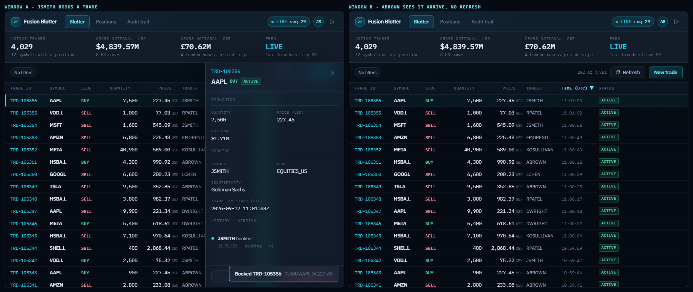

# Real-time equity trade blotter

View, create, amend and cancel equity trades. A change made in one window appears in every other
connected window without a refresh.



Built for the TP ICAP full stack take-home exercise. Next.js 16 and React 19 on the front, Express 5
and Socket.IO on the back, Prisma 7 over PostgreSQL 17, Redis for sessions, one shared zod contract
between them, Docker Compose to run it.

## Run it

You need Docker with Compose v2. There is no `.env` to create: compose carries development values.

```bash
git clone <this repository>
cd tp-icap-take-home-assessment
npm run start
```

That builds the images and waits until all five services are healthy: Postgres, Redis, a one-shot
migration, the API and the web app. The first build takes a few minutes.

| | |
|---|---|
| Web app | <http://localhost:3000> |
| Sign in | `jsmith` or `abrown` (traders), `mjones` (desk head), `viewer` (read only). Password `FusionDemo!2026` |
| API | Through the web app only: `/ready`, `/health`. It has no published port |

`npm run stop` stops the stack and keeps the data. `docker compose down -v` discards it.

An empty database is seeded with 500 trades across the five trading days before first start, plus
the four accounts. A simulated desk then books, amends and cancels every few seconds, so the blotter
moves on its own.

**To see the real-time behaviour:** open two windows, book a trade as `jsmith` in one and watch it
arrive in the other. Sign in as `viewer` to see the booking controls disappear. Sign in as `abrown`
to see another trader's trade greyed with "desk head only".

Anything past `npm run start`, which means the tests and the scripts below, also needs Node 22 or
newer and `npm install` at the repository root. The suites run on the host, not in the containers.

## Where to find things

| The brief asks for | Where it is |
|---|---|
| Trade blotter with sorting, filtering, refresh | <http://localhost:3000>, `frontend/src/components/blotter/` |
| Create, amend, cancel | The ticket at `frontend/src/components/trade/`, the rules in `backend/src/services/trade_service/` |
| Live updates | `backend/src/realtime/`, `frontend/src/providers/ConnectionProvider.tsx` |
| Trade model | `shared/src/schemas/trade.ts`, one schema every other shape derives from |
| Database design | [`database/README.md`](database/README.md): tables, indexes, migrations, the append-only trigger |
| API design | [`docs/api_reference.md`](docs/api_reference.md): endpoints, payloads, filters, paging, errors |
| Unit and integration tests | [Running the tests](#running-the-tests) |
| Audit trail, positions, P&L, auth, validation, virtualised grid | All built. The `/audit` and `/positions` tabs, the sign-in page, and the decisions below |
| AI usage report and prompt log | [`docs/ai_usage_report.md`](docs/ai_usage_report.md), [`docs/prompt_log/`](docs/prompt_log/index.md) |

Per-workspace detail: [`frontend/`](frontend/README.md), [`backend/`](backend/README.md),
[`shared/`](shared/README.md), [`database/`](database/README.md).

## Architecture decisions

```
frontend/   Next.js 16 App Router, React 19, Tailwind v4, TanStack Query and Table, socket.io-client
backend/    Express 5 + Socket.IO, Prisma 7 over PostgreSQL 17, Redis for sessions and rate limits
shared/     @blotter/shared: one zod schema per model, every other shape derived from it
database/   @blotter/database: the Postgres image, the Prisma schema, hand-written migrations
docs/       specs, prompt log, AI usage report, verification table
```

Each decision states what was chosen and what it was chosen over.

**One shared contract package,** over hand-written types on each side. A field added to
`trade_schema` reaches the API validation, the client types and the socket payload together, so the
three cannot drift.

**PostgreSQL,** over SQLite. The API container runs on a read-only root filesystem, which a SQLite
file cannot survive, and Postgres carries real enums, a `DECIMAL(18,6)` price and an append-only
trigger.

**Socket.IO for broadcasts only,** over raw WebSocket or SSE, and over mutations on the socket.
Reconnection with backoff comes for free and the event map is typed. Mutations stay on HTTP, so they
get the same validation, error handling and rate limiting as any other write.

**One origin, the API behind the web server,** over the browser calling the API directly. The web
server forwards `/api/*`, `/socket.io/`, `/health` and `/ready` over the internal network. No API
address is compiled into the bundle and the refresh cookie needs no cross-site settings. This
narrows what is exposed rather than making the API private: every route is still reachable through
the forwarding, and authentication, validation and rate limits carry the security.

**Keyset paging,** over offset. The blotter inserts rows all day, so an offset computed on one
request points somewhere else on the next, and page two re-serves and skips rows. A cursor names a
row.

**Cache patching, not refetching.** Every broadcast is applied to the cache in place, through one
`apply_trade` shared with the client's own mutations. A window left open makes no requests while the
link is healthy; it refetches only on a sequence gap or a reconnect. Invalidating on every event
cost one request per loaded page per broadcast and tripped the rate limiter in ordinary use.

**TanStack Table, headless,** over AG Grid. AG Grid brings its own theme and DOM, which would mean
design tokens fighting a third-party stylesheet. react-virtual handles the rows.

**Real authentication, three roles,** over none. A blotter carries counterparty names, sizes and
prices, which a firm does not serve to anonymous readers. `VIEWER`, `TRADER` and `ADMIN` map to
named permissions; routes require the permission, never the role, and a trader may act only on their
own trades.

**Amendment is a version, not a status,** over adding `AMENDED`. The brief allows `ACTIVE` and
`CANCELLED`, so an amendment increments `version`, writes an audit row, and the grid shows a `v2`
pill.

**Append-only audit enforced by a database trigger,** over a convention. An audit trail the
application can rewrite is not an audit trail.

**Mutations blocked while disconnected, never queued,** over an offline queue. A confirmation for a
trade the server has not accepted is a worse failure on a desk than a disabled button, and the
button says why it is disabled.

**P&L on a simulated mark, labelled as such,** over notional only, and over a market feed the brief
does not supply. Average cost and realised P&L come from one walk in `shared/` that the server runs
after every write; unrealised P&L is the client marking open size against a mark that arrives over
the socket. Every screen showing a mark says it is simulated.

**Filters and sort in the URL,** over component state. A filtered blotter is linkable, survives a
reload, and the back button undoes a filter. Selection stays in memory.

**Prices in the instrument's currency.** London names quote in GBX (pence), as the exchange quotes
them, and the notional column shows pounds. There is no FX normalisation, so the notional limit is
per currency.

The two design specs record the options each decision was chosen from:
[the API](docs/superpowers/specs/2026-09-12-trade-api-design.md) and
[the interface](docs/superpowers/specs/2026-09-12-interface-behaviour-design.md).

## Running the tests

| Script | Covers | Needs | Result |
|---|---|---|---|
| `npm test` | Unit and route tests in all three workspaces. The contract, the services and routes against in-memory repositories, and on the client the cache patching, formatting, flash, keyboard focus, date range and ticket validation | Node 22, `npm install` | 493 pass |
| `npm run test:integration` | The Prisma repositories, the Redis refresh store and positions against real Postgres and Redis, including the append-only trigger | the compose stack | 42 pass |
| `npm run test:e2e` | Playwright in two browser contexts: live sync between clients, a concurrent amend refused with 409, the role rules, a dropped link blocking booking then resyncing, lockout, theme, filters and keyboard use | the compose stack | 18 pass |
| `npm run test:load` | k6, four virtual users for sixty seconds inside the API's rate limits | the compose stack and [k6](https://k6.io) | p95 209ms |
| `npm run test:lighthouse` | Lighthouse on the login page and the blotter | the compose stack | login 100/100/96/100, blotter 99/96/100/100 |
| `npm run test:all` | The first three in sequence | the compose stack | |

The browser tier needs Chromium once: `cd frontend && npx playwright install chromium`.

Three tests carry the real-time claim. `backend/src/realtime/socket_broadcast.test.ts` boots the
server, connects two clients and checks a trade created by one reaches the other.
`frontend/e2e/liveSync.spec.ts` makes the same claim in two real browsers.
`frontend/src/lib/query/applyBroadcast.test.ts` covers where a broadcast lands in a sorted,
filtered, paged view, and that a stale version is dropped.

CI (`.github/workflows/ci.yml`) runs install, the shared build, typecheck, lint, the unit tier, the
migrations and the integration tier on every push.

### Other scripts

| Script | Does |
|---|---|
| `npm run dev` | The same stack, attached, with logs streaming |
| `npm run logs` | Follow the running stack's logs |
| `npm run build` | Build the shared contract, the API and the web app locally |
| `npm run typecheck` | `tsc --noEmit` in all three workspaces |
| `npm run lint` | ESLint on the web app |
| `npm run db:generate` | Regenerate the Prisma client from `database/prisma/schema.prisma` |
| `npm run db:migrate` | Apply the migrations to `DATABASE_URL` |
| `npm run db:status` | Report which migrations are applied and which are pending |

### Running without Docker

Needs Node 22 or newer. Postgres and Redis can still come from compose:

```bash
npm install
npm run build:shared
npm run db:generate
npm run dev:deps          # Postgres and Redis only
npm run dev:backend       # http://localhost:5000
npm run dev:frontend      # http://localhost:3000
```

Create a root `.env` from `.env.example`. It needs at least `DATABASE_URL`, `REDIS_URL`,
`JWT_ACCESS_SECRET` and `JWT_REFRESH_SECRET`; the full list is in
[`docs/api_reference.md`](docs/api_reference.md). `npm run build:shared` and `npm run db:generate`
are not optional on a fresh clone: both apps import the contract from its built output, and the
Prisma client is generated rather than committed.

## Assumptions

- A trade's `trader` comes from the access token, so you book as yourself. The brief's sample
  payload shows `trader` as a client field.
- The brief states the trade model twice and the two disagree. The model carries every field from
  both, plus `version`, `currency`, `createdAt` and `updatedAt`.
- The browser reaches only the web app. A public address in front of it, a tunnel for instance, has
  to be added to `CORS_ORIGINS`, because the socket handshake checks it.
- The demo accounts share a documented password. They exist so a reviewer can sign in to a
  throwaway local stack, and nothing about that should survive a real deployment.
- Sessions live in Redis without persistence, so a Redis restart signs everybody out.
- The broadcast sequence restarts when the API process does. The client treats a decrease as a
  restart and resyncs.
- The seed skips weekends but not exchange holidays, since a real calendar is per venue.
- All times are shown in UTC, because a session runs on the venue's clock, not the viewer's.

## Trade-offs accepted

- **The frontend follows React naming, the rest stays snake_case.** In `frontend/`, state pairs are
  camelCase, component files are PascalCase and every other file is camelCase. The backend, `shared`
  and `database` keep `snake_case`.
- **The React Compiler is off.** TanStack Table v8 returns functions it cannot memoise, so the grid
  opts out and memoises by hand.
- **Text filters match case-insensitive substrings,** which forgoes the btree indexes on those
  columns. Acceptable at the dataset size the brief describes.
- **The e2e suite shares sign-ins** rather than isolating every test, because the API limits
  credential requests to ten a minute per address. Each test resets the page instead.
- **No path aliases in the backend.** Under ESM with `nodenext`, TypeScript does not rewrite them at
  emit, and the source tree is shallow enough not to need them.
- **Five high-severity `npm audit` findings remain,** all reached through the Prisma 7 toolchain at
  build time. The suggested fix downgrades Prisma to 6, a breaking change.
- **Lighthouse and the e2e tier run against a live stack, not in CI.** They need the built images and
  a browser, so those numbers are observed locally and quoted as such.
- **No market data feed.** Marks are a simulated walk, and the P&L is real arithmetic on simulated
  prices.
- **No cloud deployment.** The brief accepts a repository that installs and runs locally on any OS.
- **No idempotency keys, `ETag`, `SERIALIZABLE` isolation or a Redis socket adapter.** Each is a
  correct next step for more than one API container. The `version` column and the sequence resync
  cover the cases they would.
- **No column resizing, reordering, grouping or CSV export.** The brief asks for sorting and basic
  filtering.

## AI usage

AI-assisted development was used throughout, under a rule that no agent decides anything about the
system. Which tools, how, and where suggestions were taken or refused is in
[`docs/ai_usage_report.md`](docs/ai_usage_report.md). The prompts are in
[`docs/prompt_log/`](docs/prompt_log/index.md), and the line-by-line check against the brief is in
[`docs/artifacts/submission_verification.html`](docs/artifacts/submission_verification.html).
