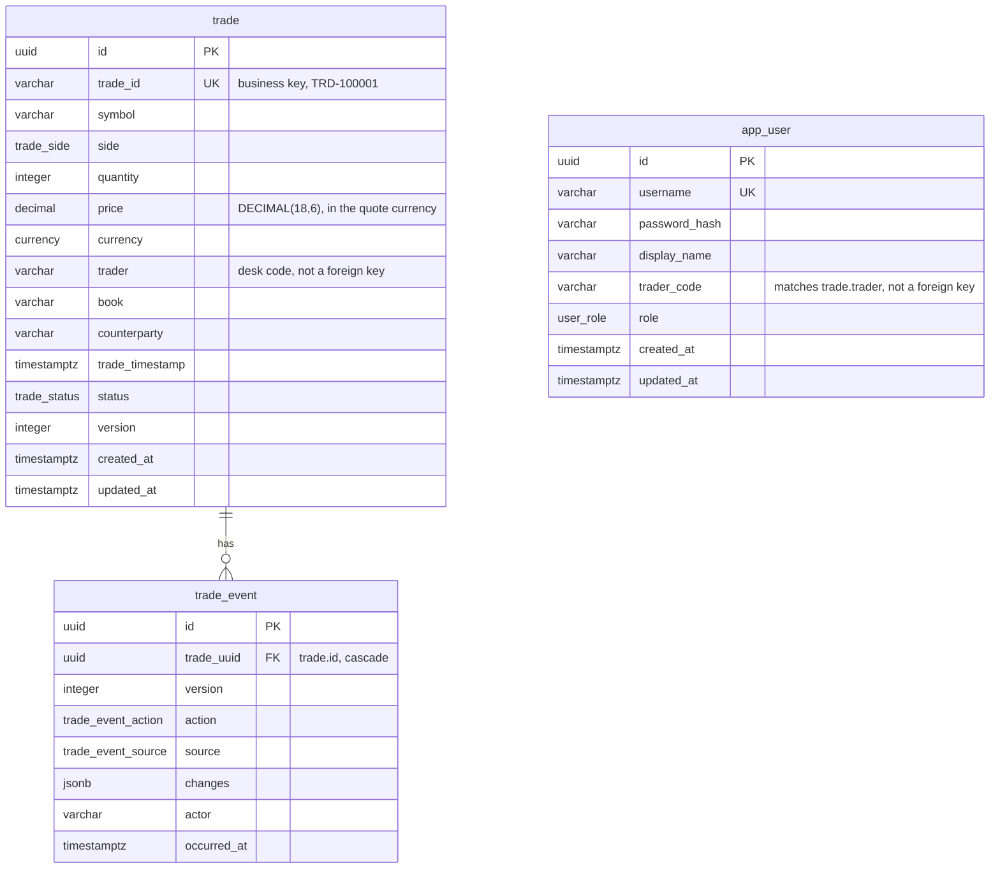

# Database

The database is its own unit. This directory owns the Postgres container image, the Prisma schema,
the hand-written migrations and the one-shot image that applies them. The API in
[`../backend/`](../backend/) keeps the generated client, the seed code and the application, and
needs exactly one thing from here: a `DATABASE_URL` to connect to.

Postgres already runs as its own container, the compose `database` service, with its own volume
and a `pg_isready` healthcheck; the API reaches it over `DATABASE_URL` and nothing else. The
migrations run in their own one-shot container, the compose `migrate` service, which has to exit 0
before compose will start the API.

| Path | What it is |
|---|---|
| `postgres/Dockerfile` | The Postgres 17 image. Init scripts would go here; none are needed |
| `prisma/schema.prisma` | The schema, and the source of truth for the generated client |
| `prisma/migrations/` | The four migrations, hand-written SQL, applied in order |
| `prisma.config.ts` | Where the Prisma CLI finds the schema and `DATABASE_URL` |
| `Dockerfile` | The migration runner: `prisma migrate deploy`, then exit |
| `compose.yaml` | The `database` and `migrate` services, included by the root compose file |
| `package.json` | `@blotter/database`, the workspace the root `db:*` scripts run in |

## Entities



One relation: a trade has many events. `app_user` stands alone on purpose. `trade.trader` and
`app_user.trader_code` carry the same desk code, but there is no foreign key between them, so a
trade keeps its attribution if the account goes.

Sessions are not a table. Refresh-token families, login lockouts and rate-limit counters live in
Redis, without persistence, because losing them on a restart means everyone signs in again and
nothing else.

## Tables

### `trade`

An executed equity trade as it appears on the blotter. Booking is the row itself; amending and
cancelling change the row and write a `trade_event` in the same transaction.

| Column | Type | Why it exists |
|---|---|---|
| `id` | `UUID` PK | Internal key, stable across amendments, and what `trade_event` points at |
| `trade_id` | `VARCHAR(24)` unique | Business key, `TRD-100001`, from `trade_id_seq`, which starts at 100001 to match the brief's sample data. A database sequence rather than a counter in application memory, so the values stay unique if the API is ever run as more than one process |
| `symbol` | `VARCHAR(12)` | One of the twelve names in the shared instrument universe |
| `side` | `trade_side` enum | `BUY` or `SELL` |
| `quantity` | `INTEGER` | Positive; the seed deals in round lots |
| `price` | `DECIMAL(18,6)` | Never a float. In the instrument's own quote currency |
| `currency` | `currency` enum | `USD` or `GBX` (pence, how the London Stock Exchange quotes). Derived from the symbol by the server and stored, because a grid showing `HSBA.L` beside `AAPL` has two price scales and needs a way to tell them apart |
| `trader` | `VARCHAR(32)` | Desk code from the access token. A plain string rather than a foreign key, so a trade keeps its attribution if the account goes |
| `book` | `VARCHAR(64)` | The book the trade sits in |
| `counterparty` | `VARCHAR(128)` | Who the desk faced |
| `trade_timestamp` | `TIMESTAMPTZ(3)` | When the trade happened |
| `status` | `trade_status` enum | `ACTIVE` or `CANCELLED`, the only two the brief allows. An amendment is a version, not a status |
| `version` | `INTEGER` | Optimistic concurrency; incremented by every amendment and by the cancellation, so a write against a stale version is refused with a 409 |
| `created_at`, `updated_at` | `TIMESTAMPTZ(3)` | When the row was written and last changed |

### `trade_event`

One row per amendment or cancellation, written in the same transaction as the change it
describes, so the audit trail cannot disagree with the trade. Booking is not an event: the trade
row itself records it.

| Column | Type | Why it exists |
|---|---|---|
| `id` | `UUID` PK | The key, and the tiebreaker in the event feed's keyset cursor |
| `trade_uuid` | `UUID` FK | References `trade(id)`. Named `trade_uuid` because `trade_id` is the business key |
| `version` | `INTEGER` | The version this event produced |
| `action` | `trade_event_action` enum | `AMENDED` or `CANCELLED` |
| `source` | `trade_event_source` enum | `API` for a person, `LIVE_FEED` for the simulated desk |
| `changes` | `JSONB` | `{ "quantity": { "from": 5000, "to": 7500 } }`, changed fields only, both sides |
| `actor` | `VARCHAR(32)` | The trader code of whoever made the change |
| `occurred_at` | `TIMESTAMPTZ(3)` | When it happened, and the event feed's sort key |

Append-only, enforced by [the trigger](#the-append-only-trigger) rather than by convention.

### `app_user`

A person who can sign in and book trades.

| Column | Type | Why it exists |
|---|---|---|
| `id` | `UUID` PK | |
| `username` | `VARCHAR(64)` unique | Sign-in name |
| `password_hash` | `VARCHAR(255)` | bcrypt, cost 12 unless `BCRYPT_ROUNDS` raises it |
| `display_name` | `VARCHAR(128)` | What the interface shows |
| `trader_code` | `VARCHAR(32)` | The desk code stamped on every trade this person books |
| `role` | `user_role` enum | `VIEWER`, `TRADER` or `ADMIN`. A coarse gate: the authorisation decision is made on a permission the shared package derives from it, never on a comparison against this column |
| `created_at`, `updated_at` | `TIMESTAMPTZ(3)` | |

Named `app_user` because `user` is reserved in Postgres, and quoting a reserved word forever is a
worse trade than one unusual table name.

## Indexes

Chosen from the queries the blotter issues, not added by reflex.

| Index | Serves |
|---|---|
| `trade_status_timestamp_idx` on `(status, trade_timestamp DESC)` | The default view and the date-range filter |
| `trade_symbol_timestamp_idx` on `(symbol, trade_timestamp DESC)` | Symbol filter sorted by time, the blotter's most common query |
| `trade_symbol_idx`, `trade_trader_idx`, `trade_book_idx` | Single-column filters |
| `trade_trade_id_key` (unique) | Lookup by business key |
| `trade_event_trade_version_idx` on `(trade_uuid, version)` | One trade's history |
| `trade_event_occurred_idx` on `(occurred_at DESC, id DESC)` | The global event feed, newest first, keyset-paged. `id` is in the index in the same direction as the sort, so the tiebreaker needs no re-sort |
| `app_user_username_key` (unique) | Login looks a user up by username |
| `app_user_trader_code_idx` | From a trade's desk code back to the person |

The text filters match case-insensitive substrings, which forgoes the btree indexes on those
columns. That is acceptable at the dataset size the brief describes and is recorded as a trade-off
in the root README.

## The append-only trigger

From `prisma/migrations/20260912020000_trade_events_currency_and_append_only/migration.sql`:

```sql
CREATE OR REPLACE FUNCTION trade_event_is_append_only() RETURNS trigger AS $$
BEGIN
  RAISE EXCEPTION 'trade_event is append-only, % is not permitted', TG_OP
    USING ERRCODE = 'restrict_violation';
END;
$$ LANGUAGE plpgsql;

CREATE TRIGGER trade_event_append_only
  BEFORE UPDATE OR DELETE ON "trade_event"
  FOR EACH ROW EXECUTE FUNCTION trade_event_is_append_only();
```

A trigger rather than a convention because an audit trail the application can rewrite is not an
audit trail. A convention holds only as long as every code path honours it. The trigger holds for
whichever role connects, including the one that runs migrations, and needs no second connection
string the way a least-privilege role would. The exception surfaces as a database error, so an
accidental `UPDATE` fails loudly instead of quietly rewriting history. Deleting a trade would
cascade into its events and is therefore refused as well, which matches the rule that a trade is
never hard deleted: cancelling is a status transition.

The integration tier proves it. The last block of
[`prisma_trade_repository.integration.test.ts`](../backend/src/repositories/prisma_trade_repository/prisma_trade_repository.integration.test.ts)
issues a raw `UPDATE` and a raw `DELETE` against a real Postgres, expects both to be refused, and
reads the row back unchanged.

## Migrations

Hand-written rather than generated, so the trade-id sequence exists before the table that depends
on it, the append-only trigger is expressed in SQL at all, and `prisma migrate deploy` is
deterministic without a development database ever having existed.

| Migration | Adds |
|---|---|
| `20260910180000_init` | `trade`, `trade_id_seq` starting at 100001, the first indexes, and `trade_amendment`, which the next migration renames |
| `20260912020000_trade_events_currency_and_append_only` | The `currency` enum and column, backfilled from the ticker with a one-off correction of London prices to pence; `trade_amendment` renamed to `trade_event` and given `action` and `source`; `trade_symbol_timestamp_idx`; the append-only trigger |
| `20260912040000_add_users` | `app_user`, the `user_role` enum, the unique username index and the trader-code index |
| `20260912070000_trade_event_occurred_idx` | The index the global event feed pages on |

**Running them.** `npm run db:migrate` applies whatever `DATABASE_URL` has not seen yet. Under
compose the `migrate` service does the same on every `npm run start`, and the API is not started
until it has exited 0.

**Checking.** `npm run db:status` reports which migrations the database has applied and which are
pending.

**Adding one.** Write the SQL by hand at
`database/prisma/migrations/<timestamp>_<name>/migration.sql`, make the matching change in
`prisma/schema.prisma`, then run `npm run db:generate` so the client matches the schema. Prisma
records what it has applied in `_prisma_migrations` and never re-runs a migration, so an existing
one is never edited; a correction is a new migration.

## Seed strategy

On start, with `SEED_ON_STARTUP` true, the API creates the four demo accounts if `app_user` is
empty, then inserts 500 trades (`SEED_TRADE_COUNT`) if `trade` is empty, dated across the five
weekday sessions before the day it runs. Generation is seeded, so a given count always produces the
same trades, placed on those days. What makes it realistic is documented and tested in
[`../backend/src/lib/seed/generate_trades.ts`](../backend/src/lib/seed/generate_trades.ts): prices
drift around each instrument's own level, quantities are round lots skewed toward smaller tickets,
sessions are weekdays only, and roughly one trade in twenty is already cancelled. The simulated
desk then books, amends and cancels every three to eight seconds (`LIVE_FEED_ENABLED`,
`LIVE_FEED_MIN_INTERVAL_MS`, `LIVE_FEED_MAX_INTERVAL_MS`), keeping its active book near
`LIVE_FEED_MAX_ACTIVE_TRADES`.

The code lives in [`../backend/src/lib/seed/`](../backend/src/lib/seed/), and it is application
code rather than SQL on purpose. The generator draws on the shared instrument universe in
`@blotter/shared`, so the seed and the interface agree on what an instrument is, and the desk that
follows it writes through the trade service, so a simulated trade takes the same validation, the
same status transitions and the same broadcast as one a user books.

## Local configuration

The compose stack needs no `.env`: the compose files carry development values. If a root `.env`
exists, compose reads it too, for `${...}` interpolation and as the `backend` service's optional
env file.

Outside compose, configuration comes from one `.env` at the repository root, which you create from
`.env.example`; nothing in the repository writes it for you. Both the API and the Prisma CLI load
that file by path, and a variable already in the environment always wins over it.

| Variable | Used by |
|---|---|
| `DATABASE_URL` | The API and every `db:*` script. The only variable the API needs to reach the database |
| `TEST_DATABASE_URL` | The integration tier, `npm run test:integration`. Defaults to the compose Postgres on `localhost:5432` when unset |

`npm run db:generate` works with no `.env` at all: `prisma generate` reads the config without
connecting, so the script supplies a placeholder `DATABASE_URL` when none is set.

## The canonical location

[`prisma/schema.prisma`](prisma/schema.prisma) is the source of truth. The generated client is
written into `backend/src/generated/prisma` by `npm run db:generate` and is gitignored, so it is
regenerated on every fresh clone and in every image build rather than committed.
