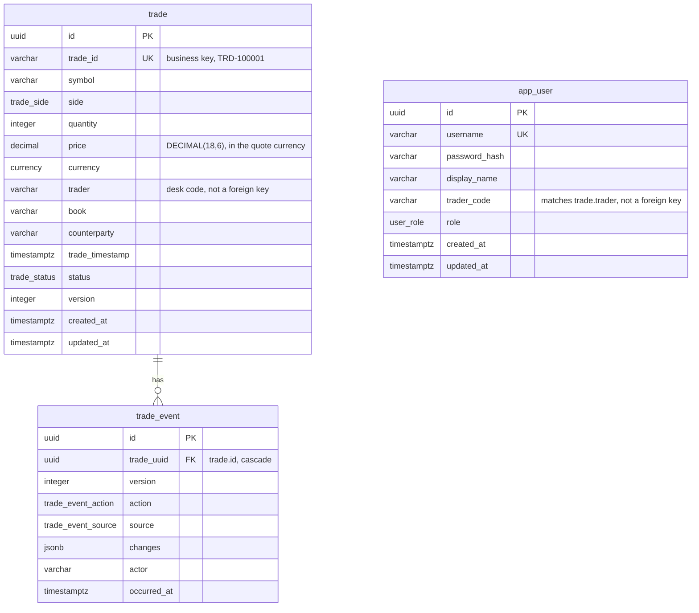

# database

This directory owns the Postgres image, the Prisma schema, the hand-written migrations and the
one-shot container that applies them. The API keeps the generated client, the seed code and the
application, and needs one thing from here: a `DATABASE_URL`.

Postgres runs as the compose `database` service with its own volume and a `pg_isready` healthcheck.
The migrations run in the compose `migrate` service, which must exit 0 before compose starts the API.

| Path | What it is |
|---|---|
| `prisma/schema.prisma` | The schema, and the source of truth for the generated client |
| `prisma/migrations/` | Four migrations, hand-written SQL, applied in order |
| `prisma.config.ts` | Where the Prisma CLI finds the schema and `DATABASE_URL` |
| `postgres/Dockerfile` | The Postgres 17 image |
| `Dockerfile` | The migration runner: `prisma migrate deploy`, then exit |
| `compose.yaml` | The `database` and `migrate` services, included by the root compose file |

## Entities


```mermaid
erDiagram
    trade ||--o{ trade_event : has

    trade {
        uuid id PK
        varchar trade_id UK "business key, TRD-100001"
        varchar symbol
        trade_side side
        integer quantity
        decimal price "DECIMAL(18,6), in the quote currency"
        currency currency
        varchar trader "desk code, not a foreign key"
        varchar book
        varchar counterparty
        timestamptz trade_timestamp
        trade_status status
        integer version
        timestamptz created_at
        timestamptz updated_at
    }

    trade_event {
        uuid id PK
        uuid trade_uuid FK "trade.id, cascade"
        integer version
        trade_event_action action
        trade_event_source source
        jsonb changes
        varchar actor
        timestamptz occurred_at
    }

    app_user {
        uuid id PK
        varchar username UK
        varchar password_hash
        varchar display_name
        varchar trader_code "matches trade.trader, not a foreign key"
        user_role role
        timestamptz created_at
        timestamptz updated_at
    }
```

One relation: a trade has many events. `app_user` stands alone on purpose. `trade.trader` and
`app_user.trader_code` carry the same desk code with no foreign key between them, so a trade keeps
its attribution if the account goes.

Sessions are not a table. Refresh-token families, login lockouts and rate-limit counters live in
Redis without persistence, because losing them on a restart means everyone signs in again and
nothing else.

`app_user` is named that way because `user` is reserved in Postgres.

## Tables

### `trade`

An executed trade as it appears on the blotter. Booking is the row. Amending and cancelling change
the row and write a `trade_event` in the same transaction.

| Column | Type | Notes |
|---|---|---|
| `id` | `UUID` PK | Internal key, stable across amendments |
| `trade_id` | `VARCHAR(24)` unique | Business key, `TRD-100001`, from `trade_id_seq` starting at 100001 to match the brief's sample data |
| `symbol` | `VARCHAR(12)` | One of the twelve names in the shared instrument universe |
| `side` | `trade_side` enum | `BUY` or `SELL` |
| `quantity` | `INTEGER` | Positive |
| `price` | `DECIMAL(18,6)` | Never a float. In the instrument's quote currency |
| `currency` | `currency` enum | `USD` or `GBX` (pence). Derived from the symbol by the server and stored, because a grid showing `HSBA.L` beside `AAPL` has two price scales |
| `trader` | `VARCHAR(32)` | Desk code from the access token |
| `book` | `VARCHAR(64)` | The book the trade sits in |
| `counterparty` | `VARCHAR(128)` | Who the desk faced |
| `trade_timestamp` | `TIMESTAMPTZ(3)` | When the trade happened |
| `status` | `trade_status` enum | `ACTIVE` or `CANCELLED`, the only two the brief allows |
| `version` | `INTEGER` | Optimistic concurrency. Incremented by every amendment and by the cancellation, so a write against a stale version is refused with a 409 |
| `created_at`, `updated_at` | `TIMESTAMPTZ(3)` | |

### `trade_event`

One row per amendment or cancellation, written in the same transaction as the change it describes, so
the audit trail cannot disagree with the trade. Booking is not an event: the trade row records it.

| Column | Type | Notes |
|---|---|---|
| `id` | `UUID` PK | The key, and the tiebreaker in the feed's keyset cursor |
| `trade_uuid` | `UUID` FK | References `trade(id)`. Named `trade_uuid` because `trade_id` is the business key |
| `version` | `INTEGER` | The version this event produced |
| `action` | `trade_event_action` enum | `AMENDED` or `CANCELLED` |
| `source` | `trade_event_source` enum | `API` for a person, `LIVE_FEED` for the simulated desk |
| `changes` | `JSONB` | `{ "quantity": { "from": 5000, "to": 7500 } }`, changed fields only, both sides |
| `actor` | `VARCHAR(32)` | The trader code of whoever made the change |
| `occurred_at` | `TIMESTAMPTZ(3)` | When it happened, and the feed's sort key |

Append-only, enforced by [the trigger](#the-append-only-trigger).

### `app_user`

A person who can sign in and book trades.

| Column | Type | Notes |
|---|---|---|
| `id` | `UUID` PK | |
| `username` | `VARCHAR(64)` unique | Sign-in name |
| `password_hash` | `VARCHAR(255)` | bcrypt at `BCRYPT_ROUNDS` |
| `display_name` | `VARCHAR(128)` | What the interface shows |
| `trader_code` | `VARCHAR(32)` | The desk code stamped on every trade this person books |
| `role` | `user_role` enum | `VIEWER`, `TRADER` or `ADMIN`. A coarse gate: the authorisation decision is made on a permission derived from it, never on a comparison against this column |
| `created_at`, `updated_at` | `TIMESTAMPTZ(3)` | |

## Indexes

Chosen from the queries the blotter issues.

| Index | Serves |
|---|---|
| `trade_status_timestamp_idx` on `(status, trade_timestamp DESC)` | The default view and the date-range filter |
| `trade_symbol_timestamp_idx` on `(symbol, trade_timestamp DESC)` | Symbol filter sorted by time, the most common query |
| `trade_symbol_idx`, `trade_trader_idx`, `trade_book_idx` | Single-column filters |
| `trade_trade_id_key` (unique) | Lookup by business key |
| `trade_event_trade_version_idx` on `(trade_uuid, version)` | One trade's history |
| `trade_event_occurred_idx` on `(occurred_at DESC, id DESC)` | The global event feed, keyset-paged. `id` sits in the index in the sort direction, so the tiebreaker needs no re-sort |
| `app_user_username_key` (unique) | Login by username |
| `app_user_trader_code_idx` | From a desk code back to the person |

Text filters match case-insensitive substrings, which forgoes the btree indexes on those columns.
That is recorded as a trade-off in the root README.

## The append-only trigger

```sql
CREATE OR REPLACE FUNCTION trade_event_is_append_only() RETURNS trigger AS $$
BEGIN
  RAISE EXCEPTION 'trade_event is append-only, % is not permitted', TG_OP
    USING ERRCODE = 'restrict_violation';
END;
$$ LANGUAGE plpgsql;

CREATE TRIGGER trade_event_append_only
  BEFORE UPDATE OR DELETE ON "trade_event"
  FOR EACH ROW EXECUTE FUNCTION trade_event_is_append_only();
```

A trigger rather than a convention, because a convention holds only as long as every code path
honours it. This holds for whichever role connects, including the one that runs migrations, and an
accidental `UPDATE` fails loudly instead of quietly rewriting history. Deleting a trade would cascade
into its events, so that is refused too, which matches the rule that a trade is never hard deleted.

The integration tier proves it. The last block of
[`prisma_trade_repository.integration.test.ts`](../backend/src/repositories/prisma_trade_repository/prisma_trade_repository.integration.test.ts)
issues a raw `UPDATE` and a raw `DELETE` against a real Postgres, expects both to be refused, and
reads the row back unchanged.

## Migrations

Hand-written rather than generated, so the trade-id sequence exists before the table that depends on
it, the trigger is expressed in SQL at all, and `prisma migrate deploy` is deterministic without a
development database ever having existed.

| Migration | Adds |
|---|---|
| `20260910180000_init` | `trade`, `trade_id_seq` starting at 100001, the first indexes, and `trade_amendment` |
| `20260912020000_trade_events_currency_and_append_only` | The `currency` enum and column, backfilled from the ticker with a correction of London prices to pence; `trade_amendment` renamed to `trade_event` with `action` and `source`; `trade_symbol_timestamp_idx`; the trigger |
| `20260912040000_add_users` | `app_user`, the `user_role` enum, the unique username index and the trader-code index |
| `20260912070000_trade_event_occurred_idx` | The index the global event feed pages on |

`npm run db:migrate` applies what `DATABASE_URL` has not seen. Under compose the `migrate` service
does the same on every `npm run start`. `npm run db:status` reports applied and pending.

To add one: write the SQL at `prisma/migrations/<timestamp>_<name>/migration.sql`, make the matching
change in `prisma/schema.prisma`, then run `npm run db:generate`. Prisma records what it has applied
and never re-runs a migration, so an existing one is never edited. A correction is a new migration.

## Seed strategy

On start, with `SEED_ON_STARTUP` true, the API creates the four demo accounts if `app_user` is empty,
then inserts `SEED_TRADE_COUNT` trades if `trade` is empty, dated across the five weekday sessions
before the day it runs. Generation is seeded, so a given count always produces the same trades.

What makes it realistic is tested in
[`generate_trades.ts`](../backend/src/lib/seed/generate_trades.ts): prices drift around each
instrument's own level, quantities are round lots skewed toward smaller tickets, sessions are
weekdays only, and roughly one trade in twenty is already cancelled.

The seed is application code rather than SQL on purpose. The generator draws on the shared instrument
universe, so the seed and the interface agree on what an instrument is, and the simulated desk writes
through the trade service, so a simulated trade takes the same validation, status transitions and
broadcast as one a user books.

## The canonical location

[`prisma/schema.prisma`](prisma/schema.prisma) is the source of truth. The generated client is
written into `backend/src/generated/prisma` by `npm run db:generate` and is gitignored, so it is
regenerated on every fresh clone and in every image build rather than committed. `prisma generate`
reads the config without connecting, so the script supplies a placeholder `DATABASE_URL` when none is
set.

## Related

- [Repository README](../README.md): architecture decisions, installation, tests
- [`backend/README.md`](../backend/README.md): the API that owns this schema's client
